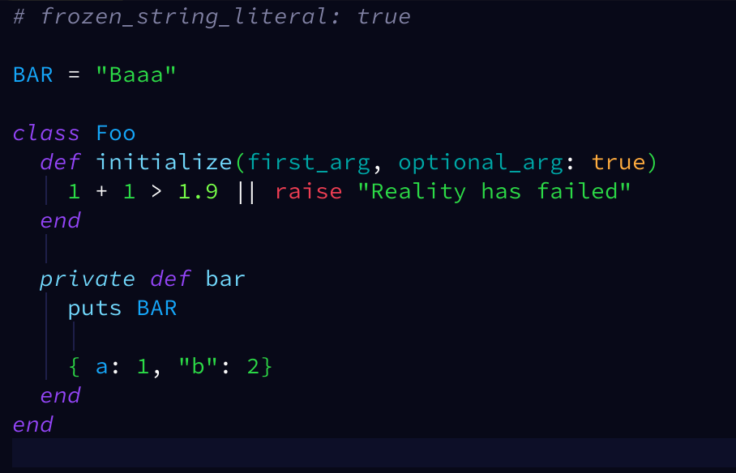

Vim-AdCode
==========

A colourful Vim/Nvim theme for bright developers.

Uses blue/purple for most things so that values and constants really ✨**pop**✨!

Used in [my Vim/Neovim config](https://github.com/AdamWhittingham/vim-config), with support for several popular plugins.

Contributing
------------

The config is built using Palette(https://github.com/joshuaclayton/palette) for nice things like variables and automatic terminal colour code generation.

To make changes:

1. Run `make dev` to begin watching for changes
2. Edit `adCode.palette`
3. Reload the colorscheme in Vim to try out your changes.
