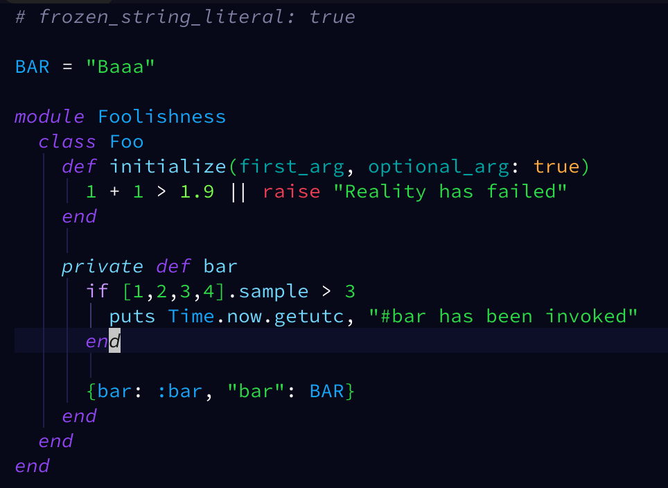

adCode
======

A colourful Vim/[Neovim] theme for **bright** developers who aren't afraid of some **colour**!

Uses dark blues for backgrounds, and bright colors so that values and constants really ✨**pop**✨!

Used in [my Vim/Neovim config](https://github.com/AdamWhittingham/vim-config), with Tree-sitter support, as well as support for several popular plugins.

Contributing
------------

The config is built by executing `theme.rb`, a Ruby script which outputs the Vim colorscheme file.

To make changes:

1. Run `make dev` to begin watching for changes
2. Edit `theme.rb`
3. Reload the colorscheme in Vim/Neovim with `:colorscheme adCode` to try out your changes. Take a look in the `tests` directory for some code to check.
